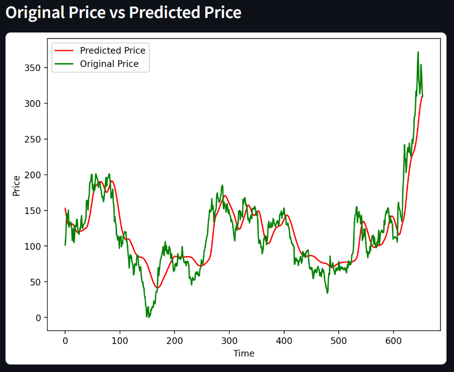

# Stock Market Prediction Using LSTM Neural Network

This project is an **end-to-end stock market prediction system** built with **Python, LSTM neural networks**, and deployed as an **interactive Streamlit web application**. It predicts stock prices based on historical data and visualizes trends using moving averages.

---

## **Project Overview**

- Fetches historical stock data from Yahoo Finance (`yfinance`)  
- Preprocesses and scales data using `MinMaxScaler`  
- Builds an **LSTM neural network** for predicting stock prices  
- Visualizes stock trends with moving averages (MA50, MA100, MA200)  
- Deploys an **interactive web app** using Streamlit for user input and predictions  
- Saves and loads trained models for future use  

---
## 📸 Screenshots  
 
### 🌿 Prediction Result  

## **Features**

- Predicts stock prices based on previous 100 days of data  
- Displays moving averages to visualize trends  
- Interactive web app: enter any stock symbol and see predictions  
- Plots **actual vs predicted prices**  
- Trained LSTM model saved as `Stock Predictions Model.keras`  

---

## **Technologies & Libraries Used**

- Python 3.x  
- NumPy, Pandas, Matplotlib  
- Scikit-Learn (MinMaxScaler)  
- Keras / TensorFlow (LSTM, Dense, Dropout)  
- Streamlit  
- yfinance  

---
